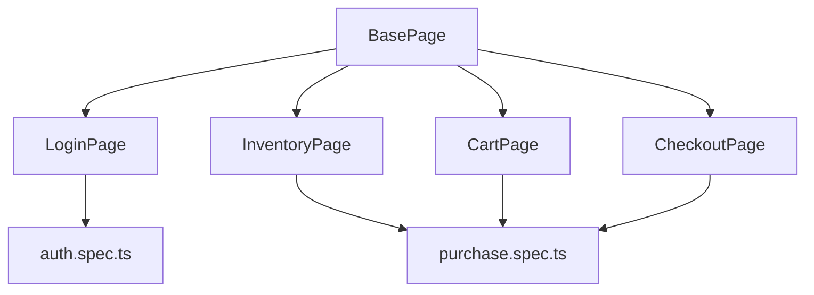

# Estrategia de Pruebas Automatizadas (Test Strategy) - Sauce Demo

Este documento define la arquitectura técnica y las decisiones de diseño para la automatización de las pruebas en **Sauce Demo**.

---

## 1. Arquitectura Técnica
Decidimos utilizar **Playwright** combinado con **TypeScript** por las siguientes ventajas clave:
- **Auto-esperas (Auto-waiting)**: Playwright espera a que los elementos estén accionables antes de interactuar con ellos, reduciendo significativamente la inestabilidad (flakiness) en los tests.
- **Tipado estricto**: TypeScript previene errores en tiempo de diseño al autocompletar localizadores y métodos de página.
- **Velocidad y Paralelismo**: Permite correr pruebas paralelas en múltiples contextos usando menos recursos que alternativas heredadas como Selenium.

---

## 2. Patrón de Diseño: Page Object Model (POM)
Para mantener las pruebas legibles, modulares y fáciles de mantener, se utiliza el patrón **POM**. Esto separa la estructura de la página y las interacciones con la UI de las aserciones de la prueba.

### Estructura de Clases


Cada clase representa una sección o página del sitio web:
1. **LoginPage**: Contiene campos para credenciales, botones de login y selectores para los banners de error.
2. **InventoryPage**: Contiene elementos para visualizar productos, ordenarlos, y botones para agregar o remover productos de la cesta de compras.
3. **CartPage**: Contiene localizadores de los productos agregados, botones para continuar la compra o remover productos.
4. **CheckoutPage**: Maneja el formulario de información personal, muestra el resumen del pedido y confirma la orden exitosa.

---

## 3. Fixtures Personalizados (Custom Fixtures)
Para evitar la inicialización manual repetitiva de cada Page Object en cada bloque `test`, extendemos el objeto `test` nativo de Playwright. 
En lugar de escribir:
```typescript
test('flujo de compra', async ({ page }) => {
  const loginPage = new LoginPage(page);
  const inventoryPage = new InventoryPage(page);
  // ...
});
```
Usamos una fixture personalizada `baseFixtures.ts` que inyecta automáticamente las páginas listas para usar:
```typescript
test('flujo de compra', async ({ loginPage, inventoryPage, cartPage, checkoutPage }) => {
  await loginPage.navigate();
  // ...
});
```
Esto reduce la sobrecarga de código de configuración en los specs y mantiene las pruebas sumamente limpias y enfocadas.

---

## 4. Estrategia de Aserciones
- Usaremos aserciones nativas de Playwright (`expect(...)`) que soportan esperas automáticas (web-first assertions).
- Se evitarán esperas estáticas o explícitas (`page.waitForTimeout`) a favor de esperas basadas en el estado del selector (`locator.waitFor`, `expect(locator).toBeVisible()`).

---

## 5. Ejecución y Reportes
- **Local**: Las pruebas se ejecutan localmente en modo interactivo (`npx playwright test --ui`) o en consola (`npx playwright test`).
- **CI/CD**: Las pruebas se ejecutan de manera headless en la pipeline de GitHub Actions ante cada push o PR.
- **Reportería**: Se genera un reporte HTML detallado tras cada ejecución. En caso de fallas, el reporte contendrá:
  - Capturas de pantalla en el punto del fallo (Screenshots).
  - Video completo del flujo de la prueba.
  - Trazas de depuración detalladas (Traces).
